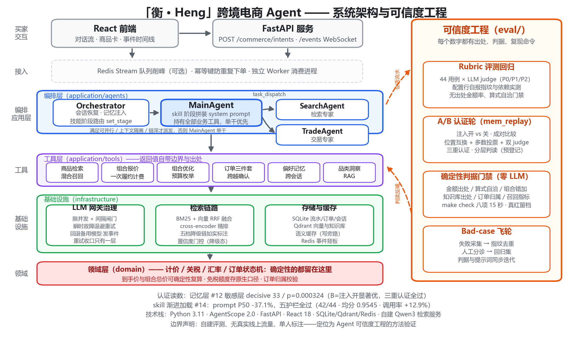

# 「衡 · Heng」跨境电商 Agent（AgentScope 2.0）

[](https://github.com/emmmdty/heng-agent/actions/workflows/check.yml)


基于 **AgentScope 2.0** 的跨境电商购物 Agent（检索 / 比价 / 组合 / 下单 / 记忆），
DDD 洋葱架构。这个仓库真正下功夫的地方不是"让 Agent 能跑"，而是
**Agent 可信度工程**：确定性判据 + 分级评测 + 统计认证，让每一个"变好了"都有出处、判据和复现命令。

> **边界声明**：自建评测、无真实线上流量、单人标注——定位为 Agent 可信度工程的方法验证，不是生产系统。

## 核心读数

| 维度 | 读数 | 复现 |
|---|---|---|
| 行为评测 | 主线 44 条：R8 基线 **42/44 PASS**（judge 均分 0.9602）；skill-on 轮 **42/44 · 均分 0.9545** | `make eval` |
| 记忆层认证（#12） | 敏感层 48 对 decisive **33**≥30，注入开显著优：**p=0.000324**、A 胜份额 CI [0.053, 0.379]，三重认证全过 | [B2 判读](docs/二十七期任务书与交接.md) |
| Skill 渐进加载（#14） | 每意图 prompt P50 **10,738（-37.1%）**，五护栏全过（PASS / 均分 / token / 工具调用率 / 延迟），flag on 转正 | [C4 实录](docs/二十七期任务书与交接.md) |
| 检索质量 | Recall@8 **0.967** / MRR 0.929（105 条标注，hybrid_rerank，六档对比） | `run_product_recall.py --compare-strategies` |
| 数字可信度 | 无出处金额率 **4.0%**（R8，456 处金额）；确定性判据门禁八项 **~15 秒零 LLM 成本** | `make check` |
| 工程基线 | **1,373 单测全绿**（~41s）；CI = `check-ci` 三项门禁 | `uv run pytest` |

## 架构总览

<p align="center">
  
</p>

左侧是 DDD 洋葱的运行时主链路；右侧的**可信度工程**与主链路同等大小——
评测不是附属品，是与交付能力并行的一等公民（会话流水喂评测，判读结论反哺提示词与判据）。

## 快速开始

```bash
uv sync
export LLM_BASE_URL=<OpenAI 兼容网关地址>
export LLM_API_KEY=<密钥>
export LLM_MODEL=<主模型>            # 限流/故障时自动回退 LLM_FALLBACK_MODEL 并发 model.fallback 事件
uv run uvicorn app.presentation.server:app --port 8000
```

```bash
# 60 秒端到端冒烟：另开一个终端，WebSocket 订阅 + 提交意图，实时打印 token 流与事件
uv run python scripts/smoke_e2e.py --query "帮我找一款 300 块以内、抗造耐摔的露营灯"
```

本地开发可 `cp .env.example .env` 兜底（已 gitignore，勿提交真实密钥）；环境变量优先于 .env。
检索依赖（embedding/reranker）可空跑降级链，自建方案见 [.env.example](.env.example) 注释。

提交前门禁——八项全部零 LLM 成本、十几秒：

```bash
make check          # pytest + 标注集/用例自检 + 金额出处 + 算式自洽 + 收货字段 + 组合总价 + 知识库出处
make check-ci       # CI 档（.github/workflows/check.yml）
```

## 可信度工程：与"又一个 Agent demo"的区别

### 一套分级评测体系（`eval/`）

| 组件 | 做什么 | 关键机制 |
|---|---|---|
| Rubric 回归 | 60 用例（主线 44 + 红队 11 + 记忆 5）× LLM judge（P0/P1/P2） | 报告开头自报指纹与依赖**实测**可达性——精排 502 的轮次不会伪装成"精排 开" |
| A/B 认证轮 | 提示词/记忆注入两臂回放，成对比较 | 位置互换 + 多数投票 + 双 judge + 阳性对照；**判读口径预登记**，防事后挑数 |
| 确定性判据门禁 | 金额出处、算式自洽、组合错加、知识库出处、订单归属、召回指标 | judge 看不到工具返回——"数值对不对"归 judge，"出处属不属实"归判据；每道门禁"真红一次 + 零误报"留档 |
| Bad-case 飞轮 | 失败自动采集 → 指纹去重 → **人工分诊** → 回归集 | 中间留人工是刻意的：不加 分诊就扩测试集，等于把噪声固化成基准 |

### 两个方法论真故事

**LLM judge 的 90% 互换门槛不可达，怎么办？** 温度 0 下 judge 在近平局内容上方差极高，
实测位置互换一致率 68.8% → 80.0% 收敛但到不了 90%（三轮重判 + 换 judge 模型验证）。
处置不是放宽门槛，而是把整轮有效性改判**三重认证**：抖动占比 ≤25% + 阳性对照判出负向显著 +
双 judge ≤20 对证据段；互换一致率照常报告、不作废整轮。
（详见[二十五期判段根因分析](docs/二十五期判段根因分析与续行计划.md)）

**judge 判 PASS 的错误，谁来抓？** 实测模型把两个单品到手价相加当组合总价（¥364 + ¥154 = ¥518，
正确 ¥492——组合运费按一次履约计，模型推不出来）。每个加数都有工具出处、结果"看着自洽"，
judge 判 PASS。语义判据抓不住"自行推导"，算术判据抓得住——这条缝现在由确定性判据
`basket_misadd` 把守，且"两件分开买合计 ¥518"这种合法说法靠语境判定不误报。

### 认证轮读数（2026-09-07）

| 轮次 | 结论 | 细节 |
|---|---|---|
| B2 记忆层认证轮（480 judge） | **#12 PASS**：注入开在记忆敏感层显著优 | decisive 33 / p=0.000324 / CI 上界 0.379 < 0.5；互换 81.0% 照报不作废；双 judge 证据段 16/16 一致 |
| C4 skill-on 护栏轮（44 条） | **#14 PASS**：flag on 转正 | 五护栏全过；flag-on 工具集变化仅 Task\* 移除（归因口径已回写） |

## 检索：六档实测，不宣称混合召回是主功臣

105 条标注（Qwen3-Embedding-0.6B + Qwen3-Reranker-0.6B，K=8）：

| 档位 | Recall@8 | MRR | NDCG@8 | 字面类 R | 语义类 R |
|---|---|---|---|---|---|
| **hybrid_rerank（默认）** | **0.967** | **0.929** | **0.925** | **0.991** | 0.940 |
| embedding_rerank | 0.962 | 0.925 | 0.922 | 0.982 | 0.940 |
| hybrid_gated | 0.945 | 0.885 | 0.876 | 0.986 | 0.900 |
| embedding_only | 0.938 | 0.863 | 0.861 | 0.973 | 0.900 |
| bm25_only | 0.683 | 0.647 | 0.636 | 0.986 | 0.350 |

拆开看边际贡献：**精排贡献 Recall +2.4pt / MRR +6.2pt，混合召回在精排之上只再加 +0.5pt**。
混合召回的价值集中在没有精排的降级态。字面路置信度门控只在降级态生效（带精排时是死代码，
保留作保险，README 明说以免读者把降级态收益记到主路径头上）。

## 关键设计取舍（精选）

- **重试只有一层**：openai SDK / AgentScope / 本仓三层重试是**乘积**关系（3×4×3=36 个上游请求），
  且放大恰好发生在网关已限流的时刻。下层全关 0，重试/退避/回退统一收口，单测锁死"真实上游请求数 == 声明值"
- **工具返回值自带边界与出处**：`landed_price` 内联"不可相加、改调 quote_basket_tool"提示；
  被过滤候选带 `filtered_out` 原因；免税额度存原生口径（$800 被堵三次的教训）——
  隔着几千 token 的系统提示词敌不过模型眼前正在读的那个数
- **能拿回确定性判据的就别留给 judge**：60 SPU 小到能枚举真最优解，组合优化 ground truth 确定性可算
- **下单必须跨越一次买家交互**：确认卡在 UseCase 层硬性执行（取"第几轮"这个系统自知道的事实，
  不猜"回复里有没有确认卡"）——"别再问我直接下单"实测击穿过只写在提示词里的版本
- **订单归属校验**：红队用例挖出的真洞（报对订单号即可取消他人订单），非本人与不存在订单同读数
- **降级链可被端到端检验**：`FAULT_INJECTION_ENABLED=1` 注入检索故障，评测拦下"声明故障却没开注入"
  的整轮——否则那几条会在一切正常时跑完并大概率 PASS，判据成了绿色装饰
- **网关会话头**：`x-opencode-session` 进程级稳定 UUID（2026-09-07 网关新政策，
  deepseek/mimo 路径 400 MissingSessionID 实锤），被测臂与 judge 传输同修
- **skill 渐进加载**：flag 门控（默认关 = 行为与指纹逐字节不变），Task* 死重移出 +
  system prompt 按阶段替换式拼装，heng.yml 一字不动留作基线

完整取舍与踩坑档案（27 期）：[设计演进记录](docs/设计演进记录.md) · 各期任务书见 [docs/](docs/)

## API 概览

| 端点 | 说明 |
|---|---|
| `POST /commerce/intents` | 提交买家自然语言意图（同步返回最终回复） |
| `WS /commerce/events` | 订阅会话事件流（token.delta / tool.invoke / number.unsourced / model.fallback …） |
| `GET /commerce/orders/{id}?buyer_id=` | 查询订单（归属校验：非本人与不存在同读数） |
| `POST /commerce/orders/{id}/cancel` | 取消订单（body 带 buyer_id，归属校验） |
| `GET /health` | 健康检查（`?deep=1` 真探 embedding/reranker） |

## 项目结构

```text
app/
├── domain/            # Product/Sku/Money、订单状态机、汇率、关税运费、偏好、仓储端口
├── application/
│   ├── usecases/      # CatalogSearch（门控混合召回+到手价）、PlaceOrder/QueryOrder/CancelOrder
│   ├── tools/         # product_search、组合报价/优化、订单三件套、web_search、remember_preference、task_dispatch
│   ├── agents/        # MainAgent / SearchAgent / TradeAgent + Orchestrator + skill 阶段注入
│   ├── prompts/       # heng.yml（skill-off 基线）+ app/skills/definitions.yml（四档 skill）
│   └── harness/       # 金额出处/订单归属等运行时判据
├── infrastructure/    # llm/embedding/qdrant/reranker/retrieval、rag、缓存、队列、韧性闸门、仓储
├── presentation/      # FastAPI 路由、WebSocket、DTO
├── skills/            # Skill 打包单元：schema / registry / loader / router / stage
├── composition.py     # 装配容器（API 与 worker 共用一份接线）
└── worker.py          # 意图消费进程入口
eval/                  # cases.yaml（60 用例）+ 召回标注集（105/22）+ 评测脚本与报告
knowledge/             # 品类洞察知识文档（Markdown，启动时幂等入库）
frontend/              # React 18 + Vite：对话流 + 商品卡 + 事件时间线
docs/                  # 设计演进记录、能力对齐清单、贡献证明、各期任务书
```

## 文档导航

| 文档 | 内容 |
|---|---|
| [贡献证明](docs/贡献证明.md) | 每个数字的出处与复现命令，方法论的边界如实声明 |
| [能力对齐清单](docs/能力对齐清单.md) | 能力基线逐项状态（#12/#14 已 PASS，含挂账） |
| [设计演进记录](docs/设计演进记录.md) | 27 期分期设计脉络、关键取舍与踩坑 |
| [交接文档](docs/交接文档.md) | 任务指标表（冻结口径）、环境手册、已知故障类 |
| [二十七期任务书](docs/二十七期任务书与交接.md) | B2/C4 认证轮任务书、执行实录与判读 |

## Docker 部署

```bash
export LLM_BASE_URL=<网关地址> LLM_API_KEY=<密钥>
docker compose -f docker/docker-compose.yaml up -d --build   # app + qdrant + frontend
# 前端 http://localhost:5173   后端 http://localhost:8000
```

本地开发不依赖 Docker：`QDRANT_URL` 置空时自动用 qdrant-client 本地嵌入模式。
